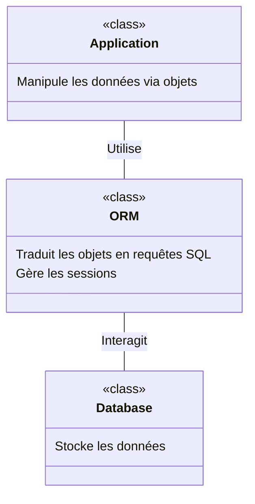

# Introduction aux ORM (Object-Relational Mapping)

## Table des matières

- [Qu'est-ce qu'un ORM ?](#qu'est-ce-qu'un-orm-)
- [Pourquoi utiliser un ORM ?](#pourquoi-utiliser-un-orm-)
- [Comment fonctionne un ORM ?](#comment-fonctionne-un-orm-)
- [Avantages des ORMs](#avantages-des-orms)
- [Schéma conceptuel d'un ORM](#schéma-conceptuel-d'un-orm)
- [Drizzle : un ORM typesafe pour TypeScript](#drizzle--un-orm-typesafe-pour-typescript)

## Qu'est-ce qu'un ORM ?

L'*Object-Relational Mapping* (ORM) est un modèle de programmation qui permet de convertir les données entre les systèmes de bases de données incompatibles et les objets programmés en langage de haut niveau. En simplifiant, un ORM est une couche d'abstraction qui agit entre la base de données et la logique de l'application. Il permet aux développeurs de manipuler la base de données avec des objets du langage de programmation utilisé, au lieu d'utiliser des requêtes SQL directes.

## Pourquoi utiliser un ORM ?

### Simplification du code
Les ORMs permettent de manipuler les données comme s'il s'agissait d'objets dans le langage de programmation choisi. Cela simplifie le développement, car le développeur peut se concentrer sur la logique de l'application sans se soucier des spécificités SQL.
Exemple tout bête avec Drizzle par exemple, en comparant avec une requête SQL :

```ts
// Avec Drizzle
const user = await drizzle
    .select({ id, username })
    .from(users)
    .where(
        eq(users.id, 1)
    )
```

Remplace une requête SQL :
```sql
SELECT id, username FROM users WHERE id = 1;
```

Ou alors, plus long et plus complexe:

```ts
// Avec Drizzle
const playerId = 6587743;

const library = drizzle
    .select({ id: libraries.game_id, hidden })
    .from(libraries)
    .leftJoin(Players, eq(libraries.player_id, Players.id))
    .leftJoin(Games, eq(libraries.game_id, Games.id))
    .where(
        and(
            eq(Players.id, playerId),
            eq(Games.is_selectable, true)
        )
    )
```

Remplace une requête SQL :

```sql
SELECT libraries.game_id AS id, libraries.hidden FROM libraries LEFT JOIN players ON libraries.player_id = players.id LEFT JOIN games ON libraries.game_id = games.id WHERE players.id = 6587743 AND games.is_selectable = true;
```

Soyez honnête, lequel est le plus lisible ? En un coup d'oeil, vous comprenez ce que fait la requête Drizzle, enfin, je sais bien qu'on n'en a pas encore parlé, mais vous voyez l'idée.

### Réduction des erreurs
En masquant la syntaxe SQL derrière des appels de fonctions de haut niveau, les ORMs réduisent les risques d'erreurs syntaxiques et logiques dans les requêtes SQL.

### Productivité accrue
Avec les ORMs, les développeurs n'ont pas besoin de passer autant de temps à écrire et à tester des requêtes SQL, ce qui permet de développer des applications plus rapidement. Et encore moins à devoir les débugger, les re-écrire, les maintenir, les documenter, etc.

### Portabilité et maintenabilité
Les ORMs facilitent la portabilité de l'application entre différents types de bases de données. De plus, le code devenant plus lisible et plus simple à comprendre, la maintenabilité s'en trouve améliorée.

## Comment fonctionne un ORM ?

Un ORM convertit les données de la base (tables, colonnes, et relations) en entités compréhensibles par le langage de programmation (classes, objets, et attributs). Voici les composantes clés d'un ORM :

- **Entités** : Classes qui représentent des tables de la base de données.
- **Sessions** : Gèrent les transactions de la base de données.
- **Migrations** : Gèrent les modifications de la structure de la base de données.

## Avantages des ORMs

- **Abstraction** : Indépendance par rapport au type de base de données.
- **Sécurité** : Protection contre les injections SQL par la paramétrisation automatique des requêtes.
- **Efficacité** : Gestion optimisée des ressources de la base de données.
- **Intégrité des données** : Gestion des relations entre les données de manière cohérente.

## Schéma conceptuel d'un ORM



## Drizzle : un ORM typesafe pour TypeScript

En fin de compte, il est important de choisir un ORM adapté à l'environnement de développement et aux exigences du projet. **Drizzle** est un exemple d'ORM conçu spécifiquement pour TypeScript. Il tire parti du système de types de TypeScript pour offrir une expérience de développement sécurisée et efficace, minimisant les erreurs courantes de manipulation des données en garantissant que les opérations sont vérifiées à la compilation plutôt qu'à l'exécution.

On en parle dans un cours suivant, mais tout d'abord, une petite aparté sur PostgreSQL, la base de données que nous allons utiliser avec Drizzle. On ne va pas s'attarder dessus, mais il est important de comprendre ce qu'est PostgreSQL, pourquoi on l'utilise, et comment l'installer, mais aussi ses différences avec MySQL ou MongoDB.
