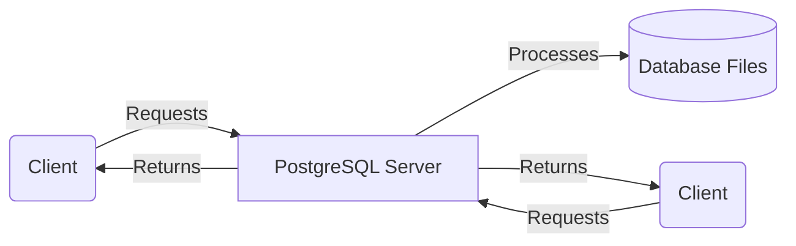

# Introduction à PostgreSQL

## Table des matières

- [Qu'est-ce que PostgreSQL ?](#qu'est-ce-que-postgresql)
- [Comparaison entre PostgreSQL, MySQL et MongoDB](#comparaison-entre-postgresql-mysql-et-mongodb)
  - [PostgreSQL vs MySQL](#postgresql-vs-mysql)
  - [PostgreSQL vs MongoDB](#postgresql-vs-mongodb)
- [Pourquoi PostgreSQL est souvent considéré comme supérieur ?](#pourquoi-postgresql-est-souvent-considéré-comme-supérieur)
    - [Points forts de PostgreSQL](#points-forts-de-postgresql)
- [Fonctionnement de PostgreSQL](#fonctionnement-de-postgresql)
- [Schéma de l'architecture de PostgreSQL](#schéma-de-l'architecture-de-postgresql)
- [Utilisation de pgAdmin 4](#utilisation-de-pgadmin-4)
- [Conclusion](#conclusion)

## Qu'est-ce que PostgreSQL ?

PostgreSQL, souvent appelé simplement Postgres, est un système de gestion de base de données relationnelle et objet (SGDB) open source. Il est particulièrement reconnu pour sa robustesse, sa conformité aux standards, et son extensibilité, ce qui en fait l'une des solutions de base de données les plus avancées et les plus utilisées dans l'industrie du développement logiciel.

## Comparaison entre PostgreSQL, MySQL et MongoDB

### PostgreSQL vs MySQL

Voici un tableau comparatif des caractéristiques clés entre PostgreSQL et MySQL :

| Caractéristique        | PostgreSQL                         | MySQL                              |
|------------------------|------------------------------------|------------------------------------|
| **Conformité SQL**     | Excellente, avec support étendu des normes SQL. | Bonne, mais avec des écarts historiques notables par rapport aux standards. |
| **Fonctionnalités avancées** | Supporte des fonctionnalités comme l'indexation full-text et les types de données géographiques. | Moins avancé, nécessite souvent des extensions ou des solutions tierces. |
| **Extensibilité**      | Permet des extensions utilisateur et prend en charge des types de données, des fonctions et des langages de programmation personnalisés. | Extensible, mais généralement plus limité comparé à PostgreSQL. |
| **Transactions**       | Support complet des transactions ACID. | Support des transactions ACID, mais avec certaines limitations dans les moteurs de stockage. |

### PostgreSQL vs MongoDB

MongoDB est une base de données orientée documents, ce qui influence directement sa comparaison avec PostgreSQL, une base de données relationnelle. Voici un tableau comparatif :

| Caractéristique        | PostgreSQL                         | MongoDB                           |
|------------------------|------------------------------------|-----------------------------------|
| **Type de base de données** | Relationnelle avec support pour JSON et fonctionnalités NoSQL. | Orientée documents, optimisée pour les grandes quantités de données semi-structurées. |
| **Transactions**       | Support complet des transactions ACID multi-tables. | Support des transactions multi-documents introduit récemment, avec des limitations. |
| **Performance**        | Excellente pour les requêtes complexes et les opérations de jointure. | Performances élevées pour des opérations de récupération simples mais peut devenir complexe pour les requêtes avancées. |
| **Flexibilité de schéma** | Schéma rigide mais supporte des éléments NoSQL via JSON/B. | Schéma flexible, idéal pour des applications nécessitant une grande agilité de développement. |

## Pourquoi PostgreSQL est souvent considéré comme supérieur ?

### Points forts de PostgreSQL

1. **Intégrité des données**: L'intégrité des données est la garantie que les données sont exactes, cohérentes et fiables au cours de leur traitement et stockage. PostgreSQL excelle dans la gestion de l'intégrité référentielle, qui est un mécanisme pour s'assurer que les relations entre les tables de la base de données restent précises. Cela est crucial pour des applications où les relations entre les données doivent être maintenues scrupuleusement, comme les systèmes de gestion de la finance ou les réservations en ligne.

2. **Respect des standards**: PostgreSQL adhère strictement aux standards SQL, ce qui le rend très compatible avec la plupart des outils de développement SQL et assure que les comportements des bases de données sont prévisibles et conformes aux attentes des normes internationales. Cela simplifie la migration des applications d'une base de données à une autre et assure que les développeurs peuvent appliquer leurs connaissances SQL universellement.

3. **Support des fonctionnalités avancées**: Prise en charge native de fonctionnalités avancées comme les opérations géospatiales et le text search. Ce SGBDR (système de gestion de bases de données relationnelles) prend en charge des fonctionnalités avancées peu communes dans d'autres bases de données gratuites, telles que les opérations géospatiales pour les applications de cartographie et le text search pour les applications nécessitant des recherches complexes dans de grands volumes de texte.

4. **Performances et optimisation**: Grâce à ses capacités d'optimisation de requêtes et son support pour divers types d'index, PostgreSQL offre des performances robustes. PostgreSQL est réputé pour ses capacités d'optimisation des requêtes, ce qui permet de traiter les données de manière plus efficace. Il supporte divers types d'index, tels que l'indexation GIN pour les recherches textuelles et les index GiST pour les données géospatiales, ce qui améliore considérablement la vitesse des requêtes sur de grands ensembles de données.

5. **Sécurité**: Fortes capacités de sécurisation des données, avec un support avancé pour le contrôle d'accès et l'authentification. La sécurité est une priorité pour PostgreSQL, qui offre de robustes fonctionnalités pour protéger les données. Il comprend un système de contrôle d'accès basé sur les rôles, qui permet aux administrateurs de définir précisément qui peut voir ou modifier certaines données. De plus, il supporte des méthodes d'authentification avancées, telles que le *SCRAM-SHA-256*, pour renforcer la sécurité des accès.

SCRAM-SHA-256, c'est un peu comme le SHA-256, mais en mieux. C'est un mécanisme d'authentification sécurisé qui protège les informations d'identification des utilisateurs contre les attaques de type "rejeu" et "homme du milieu" (MITM). Il est basé sur le protocole SASL (*Simple Authentication and Security Layer*) et utilise des fonctions de hachage cryptographiques pour vérifier l'identité des utilisateurs.

On n'est pas dans un cours de sécurité, ni dans un cours DBA, mais c'est toujours bon à savoir, non ?

## Fonctionnement de PostgreSQL

PostgreSQL utilise une architecture client-serveur où le serveur gère les fichiers de données, accepte les connexions des applications client, effectue les opérations demandées et renvoie les résultats. Les clients peuvent interagir avec PostgreSQL via de nombreuses interfaces, assurant une flexibilité et une adaptabilité élevées.

## Schéma de l'architecture de PostgreSQL

Dans ce schéma, les clients envoient des requêtes au serveur PostgreSQL, qui traite ces requêtes en accédant aux fichiers de la base de données. Le serveur renvoie ensuite les résultats aux clients, qui peuvent être des applications, des outils de gestion de bases de données ou des interfaces utilisateur.

Les **Database Files** contiennent les données stockées dans la base de données, organisées en tables, colonnes et lignes.

Bien entendu, dans le cas de notre blog avec Express, le client, ce n'est pas un utilisateur, ou le front, mais bien notre serveur Express qui va interagir avec la base de données PostgreSQL.

## Utilisation de pgAdmin 4

pgAdmin 4 est un outil de gestion graphique pour PostgreSQL. Il facilite la gestion des bases de données par une interface utilisateur intuitive, permettant de créer, modifier, administrer et visualiser les bases de données PostgreSQL facilement.

- **Installation**: Suivez les instructions disponibles sur le site officiel pour installer pgAdmin 4.
- **Gestion des bases de données**: Utilisez l'interface graphique pour gérer les bases de données, exécuter des requêtes SQL, et visualiser les résultats.

## Conclusion

PostgreSQL se distingue par ses capacités avancées, son respect des standards, et sa flexibilité, ce qui en fait un choix de premier ordre pour les développeurs et les entreprises recherchant une solution de gestion de base de données puissante et fiable. En intégrant des outils comme pgAdmin 4, les utilisateurs peuvent maximiser l'efficacité de leur gestion des bases de données PostgreSQL.

Par ailleurs, expérience personnelle, si vous avez besoin d'hoster une base de données PostgreSQL, je vous recommande [Neon.tech](https://neon.tech/), un service d'hébergement cloud qui propose des instances PostgreSQL. Il y a un free tier, et c'est très simple à utiliser.

En revanche, évitez de passer par des offres où l'on ne précise pas la version de PostgreSQL, ou qui ne sont pas maintenues régulièrement (pour ne pas citer, une plateforme avec un tigre comme mascotte).

PostgreSQL est un SGBDR très puissant, mais il faut savoir le configurer et le maintenir correctement pour en tirer le meilleur parti.